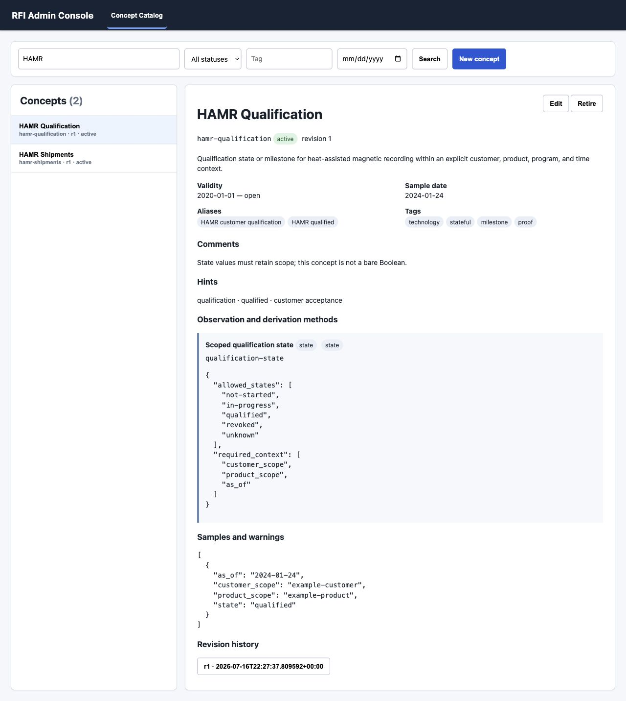
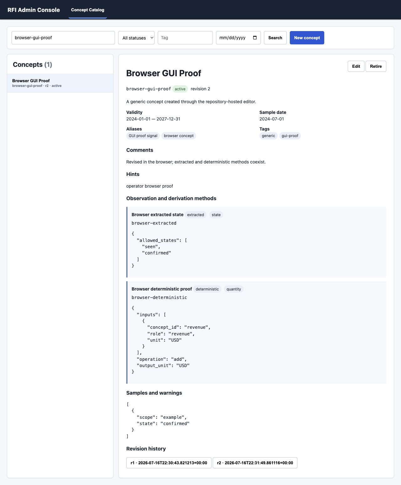

# Business concept catalog and admin console

TASK-009 adds an independent definition authority and the first repository-hosted web
administration surface. The sample financial and HAMR concepts prove breadth; they are not a final
ontology.

## Boundaries and dependency direction

```text
Operator / programmatic caller
              |
              v
       ConceptService  <--------- Admin HTTP adapter and console shell
              |
              v
       ConceptRepository
       - immutable revisions
       - atomic current pointer
       - definition validity

ConceptRevision + ObservationMethod
              |
              v
       ObservationService
       - extracted observation construction
       - deterministic calculation
       - explicit lineage and comparison
```

`rfi.concepts` owns definitions, not evidence or observed facts. It imports no acquisition, source,
knowledge, retrieval, intelligence, or workspace repository. Existing upstream layers do not
import the catalog. The admin handler calls `ConceptService`; it never enumerates or edits revision
files. `rfi.admin` is a composition root that constructs the repository and service for the local
process.

The architecture keeps four things distinct:

- A **concept revision** defines current or historical meaning.
- An **observation method** defines an admissible way to populate or derive that meaning.
- An **observation** is a particular value, state, event, relationship, or assertion pinned to an
  exact concept revision and method.
- A **deterministic derivation** creates a new calculated observation with exact input lineage. It
  neither mutates nor suppresses extracted observations.

Definitions are not source evidence and do not become observations merely because they exist.
Observations in TASK-009 are public value contracts and proof values; a future observation
repository remains an independent lifecycle choice.

## Contract and persistence model

`ConceptDraft` contains stable ID, display name, concise definition, comments, aliases, lookup and
extraction hints, lifecycle status, tags, classifications, validity dates, a sample date, methods,
related concepts, samples, and warnings. Creation converts editable intent into an immutable
`ConceptRevision` with:

- a monotonic revision number;
- a content-derived revision identity;
- creation and update timestamps;
- an explicit predecessor identity; and
- the complete definition and method snapshot.

The repository-controlled default location is:

```text
.artifacts/runtime/TASK-009/catalog/
  catalog.json
  revisions/concept-revision-<sha256>.json
```

`catalog.json` is an atomic current-revision and ordered-history pointer. Revision files are
immutable. A write publishes the new revision file before atomically replacing the pointer. An
injected interruption before pointer publication removes the uncommitted file and leaves the
previous catalog readable. Integrity verification checks schema, stable identities, revision
sequence, predecessor links, content digests, current selection, missing files, and orphan files.
Corrupt state fails closed.

Back up the complete catalog directory while the local single-writer server is stopped. Copying
only `catalog.json` or only revision files is not a complete backup. The catalog has no secret or
credential fields.

## Revision time and business validity

Revision history and validity answer different questions:

- `created_at`, `updated_at`, `revision_number`, and `supersedes_revision_id` describe when and how
  the catalog definition changed.
- `valid_from` and optional inclusive `valid_through` describe when that definition is applicable
  in the business domain.
- `sample_date` labels an example; it is not evidence and does not assert validity.

An edit always creates a new revision. Callers provide `expected_revision_id`; a stale editor is
rejected instead of overwriting a newer definition. Historical revisions are addressable and
content-digest checked. Retirement and supersession are statuses on new revisions, never deletion.
Historical observations preserve meaning by retaining `concept_revision_id` and `method_id`.

TASK-009 does not automatically select a revision for an observation date or rewrite old
observations when validity changes. That policy requires operational evidence and remains future
learning.

## Extensible method and observation model

The initial registry understands extracted, deterministic, state, event, assertion, forecast, and
relationship method families. Common metadata supports result shape, aliases, extraction hints,
expected evidence locations, inputs, units, dimensions, period and scope expectations, validation,
comparison, confidence, tolerance, warnings, method validity, and samples.

Method-specific `configuration` is retained as JSON-compatible data. Explicitly registered
extension kinds and `extension:` result shapes prove that the core need not understand every future
method. Unknown unregistered kinds fail validation. This provides evolution without treating any
arbitrary misspelling as valid.

`Observation.value` is deliberately generic. Result shapes include quantity, ratio, integer,
Boolean, category, state, event, range, relationship, narrative, structured, and registered
extensions. Scope, dimensions, period, effective time, unit, confidence, provenance, and warnings
travel with the value rather than being forced into one financial schema.

## Deterministic behavior and lineage

Deterministic methods use a small data-only operation contract: add, subtract, multiply, divide,
percentage, and margin-from-cost. Configuration is never executed as source code. This is enough to
prove the boundary without claiming a final formula language.

Evaluation:

1. resolves a deterministic method from the exact output concept revision;
2. checks required and unexpected roles;
3. checks each input concept and expected unit;
4. checks matching period, scope, and dimensions when declared;
5. converts numeric inputs through decimal arithmetic;
6. fails visibly for missing inputs, nonnumeric values, incompatible context, zero division, or
   unsupported operation; and
7. emits a separate calculated observation with method provenance and a `LineageReference` for
   every exact input observation, input concept revision, input method, and semantic role.

The Gross Margin proof creates a reported extracted ratio, a gross-profit-over-revenue result, and
a revenue-less-cost-of-revenue result. All three remain distinct. Reconciliation returns a visible
comparison record with the two observation IDs, difference, tolerance, and outcome. It never picks
a winner or overwrites a value.

## Diverse proof concepts

- **Revenue** proves an extracted quantity with period, scope, unit, and source provenance.
- **Gross Margin** proves reported and two deterministic methods, lineage, and comparison.
- **HAMR Qualification** is a scoped state. Its sample retains customer, product, state, and as-of
  context and warns against generalizing one qualification assertion.
- **HAMR Shipments** supports milestone events, units, capacity, and narrative assertions under one
  concept. Event and quantity observations coexist without shape coercion.
- Gross Profit and Cost of Revenue are bounded calculation-input proof concepts.

## Programmatic operation

Initialize and seed the sample proof set:

```sh
.venv/bin/python scripts/task009_concepts.py init --seed
```

Look up and inspect definitions:

```sh
.venv/bin/python scripts/task009_concepts.py list --query "gross margin"
.venv/bin/python scripts/task009_concepts.py list --tag multi-shaped --valid-on 2024-06-28
.venv/bin/python scripts/task009_concepts.py show --id hamr-qualification
.venv/bin/python scripts/task009_concepts.py history --id gross-margin
.venv/bin/python scripts/task009_concepts.py verify
```

Python callers use `ConceptRepository` through the `ConceptCatalog` protocol or use
`ConceptService` for the same use cases exposed to HTTP.

## Local admin console

Start the server:

```sh
.venv/bin/python scripts/task009_concepts.py serve --host 127.0.0.1 --port 8765
```

Open `http://127.0.0.1:8765/concepts`. Press Ctrl-C for clean shutdown. Host and port are
configurable; the default host is loopback. The standard-library threaded HTTP server adds no cloud
or framework dependency.

The persistent shell has top-level tab navigation with Concept Catalog as the first tab. New tabs
can add route adapters and panels without replacing the shell or catalog contracts. The catalog tab
supports search and filters, list/detail browsing, aliases, hints, validity, methods, samples,
warnings, related definition metadata, validation, creation, revision editing, history inspection,
and retirement.

The JSON interface includes:

- `GET /health`
- `GET|POST /api/concepts`
- `POST /api/concepts/validate`
- `GET|PUT /api/concepts/{concept_id}`
- `GET /api/concepts/{concept_id}/history`
- `POST /api/concepts/{concept_id}/retire`

The GUI and programmatic interface share `ConceptService`, validation, optimistic revision checks,
and failure messages.

## Security and failure boundary

The server is single-user and local-only by default. It has no authentication or multi-user
authorization and must not be exposed to an untrusted network. It stores no secrets in browser
state, accepts only bounded JSON request bodies for writes, emits no-store and browser-hardening
headers, rejects traversal and unknown routes, uses no requested filesystem paths, and validates
every write before publication. Server logs contain request lines but never request bodies.

Invalid IDs, duplicates, invalid dates, malformed configuration, unknown kinds, invalid
derivations, missing inputs, incompatible units or periods, calculation failures, stale revisions,
historical mutation, corrupt state, invalid requests, invalid forms, traversal, unavailable ports,
and interrupted writes have focused proof. No failure silently mutates current history.

## Validation and screenshots

Run focused proof and tests:

```sh
make task009-proof
PYTHONPATH=src .venv/bin/python -m unittest tests.test_task009 -v
```

The real-browser proof created a generic concept, validated it, saved it, added a deterministic
method and validity end date, saved revision two, and inspected both historical revisions.





## Limitations and expected realignment

- The concept model and method configuration will change with operational domain learning.
- The operation set is a proof contract, not a complete formula or financial calculation language.
- There is no durable observation store, extraction engine, XBRL mapping, automatic reconciliation,
  formula graph scheduler, or revision-by-observation-date policy.
- Units are exact labels; there is no conversion or dimensional-analysis engine.
- State vocabularies, event taxonomies, scopes, dimensions, and validation conditions are retained
  configuration, not comprehensive executable semantics.
- Catalog publication is single-writer and local; there is no lock service or concurrent editing.
- The console uses JSON text areas for complex methods. This is practical for technical operators,
  but richer schema-aware controls are likely after the contracts stabilize.
- There is no authentication, authorization, collaboration, remote hosting, polished responsive
  design, production telemetry, or automatic backup.

These are deliberate boundaries. The next phase should learn from real concept authoring,
observation production, and reconciliation before selecting a broader ontology, formula language,
observation persistence model, or production administration stack.

## Architectural Status Summary

- **Repository foundation — Complete.** Task governance, validation, baseline checks, and review
  packaging remain active.
- **Acquisition — Complete contracts; usable with limitations.** Immutable collection and provider
  orchestration are established; scheduling and broad production operations remain absent.
- **Immutable evidence — Complete.** Artifact bytes and identities remain separate and authoritative.
- **Source objects — Usable with Limitations.** Stable SEC SGML structures exist; broader semantic
  parsing remains deferred.
- **Derived knowledge — Usable with Limitations.** Versioning and provenance exist over a narrow
  ontology; concept definitions do not replace this layer.
- **Governed retrieval — Complete contracts; provisional quality.** Typed packages and inspection
  remain stable; ranking quality and scale remain unproven.
- **Model-guided intelligence — Complete contracts; usable with limitations.** Bounded grounded
  reasoning exists; frontier-model and semantic quality remain provisional.
- **Consulting workspace — Complete for the POC.** Durable investigations and comparisons remain
  separate from catalog definitions.
- **Execution journal and logging — Complete for the POC.** Hash-chained operator history remains
  distinct from the catalog revision store.
- **Business concept catalog — Complete architecture; provisional domain maturity.** Durable generic
  definitions, revisions, validity, methods, lookup, editing, and diverse proof concepts exist. The
  ontology is intentionally immature.
- **Deterministic derivation — Usable with Limitations.** Typed input checks, failure semantics,
  coexistence, comparison, and lineage are proven with a deliberately small operation set.
- **Admin web console — Complete for TASK-009; usable with limitations.** A local-default multi-tab
  shell and practical catalog browser/editor exist. Authentication and production hosting do not.
- **Operational hardening — Usable with Limitations.** Atomic writes, integrity, restart, bounded
  requests, traversal rejection, security headers, failure proofs, and repository validation exist;
  concurrency, signed history, monitoring, and automated backup remain future work.

TASK-009 introduces a durable definition authority and an administration surface. It does not turn
concepts into evidence, observations into definitions, or the admin console into a new repository
authority.
