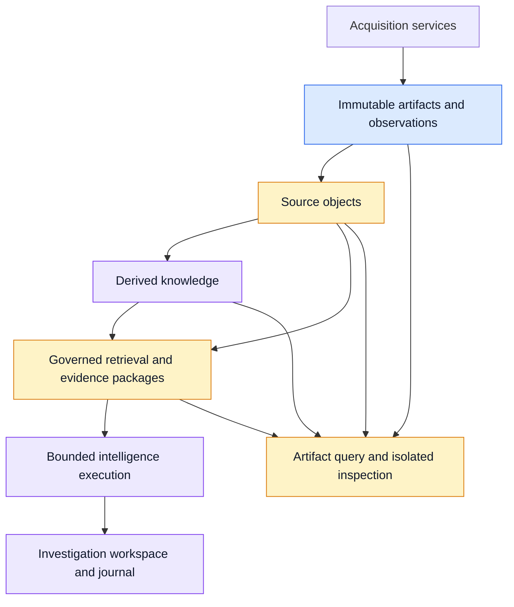
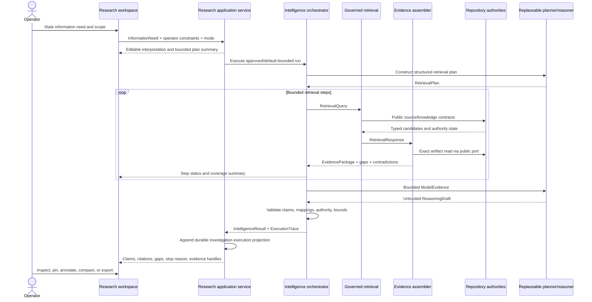

# RFI Research Workspace — Product and Architecture Design Study

**Status:** Recommendation for architectural review; no implementation authorized  
**Date:** 2026-08-06  
**Scope:** Interactive research over retained RFI data, with a governed path to later internet augmentation

## 1. Executive summary

RFI should build an **investigation-centric research workspace with conversational assistance, a persistent evidence desk, and visible bounded research plans**. A chat transcript should not be the product's durable center. The durable center should be an investigation: a consulting problem with questions, executions, operator notes, selected evidence, hypotheses or claims, unresolved questions, comparison/timeline views, and deliverable projections.

The normal experience should combine three modes without forcing the operator to choose a different product:

1. **Ask and direct** — natural-language questions and commands initiate or refine bounded work.
2. **Search and inspect** — repository search, filters, source browsing, citation expansion, and provenance traversal remain independently usable.
3. **Organize and conclude** — the operator pins evidence, records notes, compares runs or subjects, tracks gaps and contradictions, and creates a briefing or report projection.

This is preferable to a conventional chatbot because RFI's advantage is not fluent prose. It is retained evidence, authority separation, inspectability, provenance, replay, and work that compounds over time. A chat-first product would subordinate those advantages to a fragile linear transcript and encourage generated answers to become accidental working truth.

The current repository already contains more of the required architecture than the roadmap and task-ticket statuses imply. Public contracts and committed implementations exist for source objects, derived knowledge, governed retrieval, evidence packages, bounded intelligence, and durable investigations. Forty-one focused TASK-005 through TASK-008 tests pass. However, these capabilities remain POC subsystems: they are not composed into the main browser product, retrieval quality and semantic coverage are narrow, the planner and reasoner are deterministic substitutes, and there is no internet-evidence class or research application API.

The smallest useful first implementation should be **repository-only and single-operator**. It should prove one end-to-end vertical slice against actual RFI application state:

- open or create a durable investigation;
- ask a question against governed repository data;
- see and, before execution, adjust the interpreted scope;
- execute a bounded research plan through public retrieval and evidence contracts;
- receive claim-level citations with clear authority labels;
- inspect every cited excerpt and traverse to the immutable artifact;
- see contradictions, gaps, truncation, failures, and stopping reason;
- retain the execution, operator notes, and selected evidence references without treating the answer as repository truth; and
- reopen the investigation and understand what happened.

Internet research should be added only after these semantics work with repository evidence. The recommended later architecture uses an RFI-owned external-research gateway and evidence class. Search services and, selectively, model-native search or a bounded browser agent may operate behind that gateway. External discoveries are ephemeral by default, visibly ungoverned, and cannot become repository evidence except through an explicit acquisition workflow such as **Add to RFI**. That action proposes or launches ordinary governed acquisition; it does not allow the research layer to write canonical evidence.

## 2. Study basis and current-state reconciliation

This study used the repository's governing design material, relevant task tickets and ADRs, current source contracts and implementations, focused tests, operator documentation, committed history, and a live inspection of the local browser product.

Key evidence included:

- [ARCHITECTURE.md](../../ARCHITECTURE.md), [DESIGN_PRINCIPLES.md](../../DESIGN_PRINCIPLES.md), [RFI_MANIFESTO.md](../../RFI_MANIFESTO.md), [ROADMAP.md](../../ROADMAP.md), and [TASKS.md](../../TASKS.md);
- TASK-005 through TASK-008 tickets and ADR-0005 through ADR-0008;
- [source-object and derived-knowledge design](../source-objects-and-derived-knowledge.md), [governed retrieval design](../governed-retrieval-and-source-browser.md), [model-guided intelligence design](../model-guided-source-grounded-intelligence.md), and [consulting workspace design](../consulting-workspace-and-execution-journal.md);
- current contracts under `rfi.source_objects`, `rfi.knowledge`, `rfi.retrieval`, `rfi.intelligence`, `rfi.workspace`, and `rfi.artifacts`;
- the current admin server and artifact-browser implementation; and
- focused execution of `tests.test_task005`, `tests.test_task006`, `tests.test_task007`, and `tests.test_task008` (41 tests passing).

### 2.1 Reconciliation finding

The lightweight roadmap is stale for this design question. `TASKS.md` still describes TASK-007 as planned and TASK-008 as provisional. Their tickets still say `Ready`. In contrast:

- commits `2046a45` and `53c82cc` implement the intelligence and workspace layers;
- the corresponding design documents describe completed POC contracts;
- the packages and tests exist in the current tree; and
- the focused tests pass.

Accordingly, this study treats TASK-007 and TASK-008 as **implemented architectural POCs, not production product capabilities**. Their contracts are real design inputs. Their deterministic answer quality, script-based composition, filesystem workspace, and lack of integrated UI are current limitations, not evidence that the layers are absent.

### 2.2 Live product finding

The running browser product currently supports concept and firm administration, acquisition workflows, feed and mailing-list operation, streams, and a read-only artifact browser. It does not expose source-object search, derived knowledge, evidence packages, intelligence executions, or saved investigations.

Existing UI concepts worth reusing are:

- explicit read-only and authority language;
- a persistent tree/detail evidence browser;
- normalized metadata plus expandable technical detail;
- an isolated preview of untrusted stored content;
- provenance and integrity alongside the stored artifact;
- progressive disclosure rather than mandatory raw JSON; and
- visible incomplete, failed, and repairable operational states.

Existing UI concepts that should not constrain the research product are the global admin navigation, configuration-form orientation, sparse one-object detail layouts, and reliance on raw JSON for the TASK-006 through TASK-008 proofs.

## 3. Current-state architecture relevant to research

RFI currently has six conceptually separate layers. The first four are repository and access layers; the fifth is non-authoritative reasoning; the sixth is durable operator workflow state.



### 3.1 Immutable evidence and acquisition observations

Exact acquired bytes remain authoritative. Content-addressed artifacts are separate from immutable acquisition observations, attempts, provider diagnostics, and interval coverage. Acquisition adapters cannot assign repository identity or bypass the repository ingress. Current artifact query contracts provide typed firm, artifact-family, canonical-type, provider, association, status, date, order, limit, and cursor constraints without exposing SQLite.

The artifact browser uses the same repository-owned read contracts as automated consumers. It verifies stored content, serves it with restrictive headers, and renders hostile HTML in a capability-denying sandbox. Original URLs remain provenance conveniences rather than the inspection authority.

### 3.2 Source objects

`SourceObject` provides stable structural identity, exact artifact byte spans, hierarchy, role, and digest. `SourceObjectReader` supports inventory, identity lookup, document lookup, and normalized field value access. This is the correct evidence-location abstraction for citations and context expansion.

Current semantic coverage is very narrow. The only parser is a deterministic SEC complete-submission parser. It identifies the SEC header, embedded document regions, and selected header/document fields. It does not segment filing prose, earnings-call turns, press releases, feed content, mailing-list messages, tables, PDFs, or XBRL into research-ready source objects.

### 3.3 Derived repository knowledge

`DerivedObject` has stable identity, version identity, object type, semantic key, payload, status, confidence, provenance, derivation identity, supersession, and annotations. Status explicitly distinguishes confirmed, uncertain, conflicted, superseded, and stale knowledge. The repository supports provenance verification, correction, supersession, failures, and reverse navigation from source object to derived objects.

The current deriver constructs only SEC issuer entities, filing observations, and issuer-filed relationships from submission headers. This proves lifecycle and authority separation; it does not provide the substantive knowledge needed for the representative consulting workflows in this study.

### 3.4 Governed retrieval and evidence assembly

`RetrievalQuery` and `MetadataConstraints` provide repository-owned query semantics. Results preserve source-evidence versus derived-knowledge classes. A `RetrievalTrace` records candidate decisions, scores, failures, coverage notes, truncation, index generation, and authority fingerprint. `EvidencePackage` combines exact contexts, source and derived results, omissions, coverage gaps, contradictions, completeness, and byte-budget use.

Important limitations are:

- the vector implementations are deterministic POC mechanisms, not validated semantic retrieval;
- retrieval operates over the narrow source-object and knowledge inventory;
- entity constraints are low-level entity IDs rather than an operator-friendly canonical firm/topic scope;
- the artifact query service and governed retrieval service have adjacent but separate filter vocabularies;
- no integrated application lifecycle builds and refreshes source, knowledge, and retrieval generations from the live application repository; and
- no browser/API surface exposes this subsystem in the current product.

### 3.5 Bounded intelligence

`InformationNeed`, `RetrievalPlan`, `RetrievalStep`, `IntelligenceBudget`, `IntelligenceClaim`, `EvidenceReference`, `IntelligenceResult`, and `ExecutionTrace` are strong provider-neutral foundations. The orchestrator validates plans, bounds retrieval and disclosure, validates evidence packages, requires claim-to-evidence mappings, requires uncertainty on model inference, and fails closed on unsupported or unmapped output.

The POC has no live planner or reasoner adapter. The deterministic implementations recognize a small SEC-oriented vocabulary and prove control semantics, not research quality. The result's three claim kinds — source evidence, derived knowledge, and model inference — also lack a future external-evidence kind.

### 3.6 Durable workspace

The current workspace makes an investigation the durable object. An append-only, hash-chained journal stores investigation lifecycle, execution starts and terminals, annotations, exports, metrics, and reference snapshots. It supports reopen, rerun, semantic comparison, export, backup, restore, integrity checks, and partial-write recovery.

This is directionally aligned with the recommendation. It is nevertheless a thin POC:

- investigations have title, purpose, customer/engagement, status, execution IDs, annotation IDs, and export IDs;
- evidence sets, hypotheses, unresolved questions, and reusable comparison/timeline definitions are not first-class;
- retained execution projections intentionally omit exact source context and raw model exchange;
- the workspace must rehydrate evidence from upstream authorities to provide rich later inspection;
- the store is local, single-writer, and filesystem based; and
- it has no integrated browser or application API.

## 4. Representative research workflows

The design should be judged against complete consulting workflows, not isolated question answering.

### 4.1 Position change over time

**Need:** “How has Western Digital management's position on HAMR changed across earnings calls and filings?”

The operator defines company, source families, and period; reviews the interpreted scope; runs repository retrieval; inspects a timeline of exact statements; distinguishes source quotations from derived topic normalization; identifies gaps in transcript coverage; pins pivotal excerpts; records an interpretation; and later reruns after new evidence arrives to see what changed.

### 4.2 Thesis support and contradiction

**Need:** “What supports or contradicts the thesis that vendor A is deprioritizing technology X?”

The system decomposes support, contradiction, and missing-evidence searches. The answer is organized by claims rather than a single narrative. Each claim shows its authority class and evidence mapping. Contradictions remain separate objects; the model may explain them but cannot silently resolve them. The operator can mark a claim as a working hypothesis without promoting it to repository knowledge.

### 4.3 Firm comparison

**Need:** “Compare Seagate and Western Digital on product timing, stated customer demand, and capital intensity.”

The operator uses a comparison matrix whose rows are explicit dimensions and whose columns are firms or periods. Each cell contains evidence-backed claims, not free text alone. Empty cells are visible gaps. The matrix can be regenerated from a saved definition when repository evidence changes.

### 4.4 Technical event reconstruction

**Need:** “What happened in the Linux block-layer discussion leading to this patch revision?”

Search and graph browsing are primary. The system assembles the message thread, ancestor/descendant boundary, patch revisions, and exact message excerpts. Conversation helps ask follow-ups, but the core work surface is the discussion graph and evidence sequence.

### 4.5 Current-state briefing with external augmentation

**Need:** “What do we know about the announced acquisition, and what has changed since the last retained filing?”

Repository-only results establish the governed baseline. In a separate web-augmentation mode, external discoveries appear with a visually distinct authority class and freshness timestamp. The operator can request acquisition of a source. Until that completes through normal RFI acquisition, the web material remains external research evidence.

### 4.6 Resume and deliver

The operator reopens an investigation days later, sees its last conclusion, selected evidence, unresolved questions, and whether referenced repository generations have changed. The operator reruns only selected questions, compares runs, accepts or rejects model-proposed changes, and projects chosen claims and evidence into a briefing outline. The export remains a projection, not a new repository authority.

## 5. Design principles and hard constraints

1. **Investigation before transcript.** A consulting problem, not a sequence of chat messages, is the durable unit of work.
2. **Evidence before prose.** The system should be useful for search and inspection even if synthesis is unavailable.
3. **Authority is a type, not a disclaimer.** Repository evidence, derived knowledge, external evidence, model inference, and operator-authored material must remain machine-distinguishable.
4. **One retrieval semantics, multiple consumers.** Operator search, model retrieval, saved evidence sets, and deliverable citations should depend on the same repository-owned contracts.
5. **Inspectability follows capability.** Anything available to the planner or reasoner must be navigable by the operator.
6. **Normal work is calm; detail is available.** The ordinary view shows scope, plan, claims, evidence, gaps, and stopping reason. Scores, candidate decisions, raw exchanges, and full traces are on demand or diagnostic.
7. **Incomplete is a useful result.** Empty results, incomplete coverage, contradictions, budget exhaustion, stale indexes, and provider failures must not be rewritten as confidence-colored prose.
8. **Saved does not mean authoritative.** Durable investigation state can include notes and model results while clearly remaining outside repository evidence and knowledge authorities.
9. **External discovery cannot mutate the repository.** Promotion requires an explicit acquisition command and ordinary acquisition validation.
10. **Provider and UI replaceability.** Model, search provider, browser automation, ranking, and UI should depend on stable application contracts rather than define them.
11. **No raw-persistence shortcuts.** Research services must not query SQLite tables, workspace files, artifact paths, or event logs directly.
12. **Bounded autonomy.** Plans, iterations, evidence disclosure, network scope, and stopping conditions are explicit and operator-visible.

## 6. Alternatives explored

### A. Conventional conversational interface

The operator asks questions in a linear chat and receives answers with attached citations.

**Strengths:** familiar; low initial learning cost; strong for quick exploration and follow-up; simplest route to a model-backed demo.  
**Weaknesses:** evidence becomes subordinate to prose; scope and filters are easy to lose; citations are often inspected only after trust has already been granted; comparisons, timelines, and gaps fit poorly; resumption depends on rereading a transcript; raw conversation history tends to become accidental state.  
**Failure modes:** unsupported synthesis looks complete, corrections are buried, stale answers remain visually equivalent to current ones, and the user cannot tell whether retrieval or wording changed.  
**Architecture fit:** the TASK-007 result can render in chat, but the model wastes much of TASK-006 and TASK-008's value.

### B. Conversation plus evidence workspace

Chat occupies one pane; a persistent second pane contains retrieved artifacts, excerpts, provenance, contradictions, and retrieval activity.

**Strengths:** substantially better citation use and inspectability; supports exploratory dialogue while keeping evidence present; compatible with current artifact inspection concepts.  
**Weaknesses:** the transcript still tends to own the research structure; evidence collections, hypotheses, and comparisons are awkward add-ons; long-running investigations become a chat plus a pile of pins.  
**Failure modes:** evidence pane becomes decorative, only the latest answer is understandable, and operators lose the relationship among multiple runs.  
**Architecture fit:** good incremental fit but incomplete as the long-term consulting workspace.

### C. Investigation-centric workspace

The investigation is primary. Questions, executions, evidence sets, claims, notes, gaps, comparisons, timelines, and deliverables are views or objects within it. Conversation is one way to create and manipulate those objects.

**Strengths:** best resumption, comparison, evidence organization, and deliverable transition; aligns with the existing TASK-008 boundary; makes authority and run history explicit; supports both exploratory and precise work.  
**Weaknesses:** requires a coherent information architecture; risks overwhelming the operator if every object is visible at once; needs disciplined staged delivery.  
**Failure modes:** a generic “canvas” becomes cluttered, generated objects proliferate, or the investigation model is over-designed before real use.  
**Architecture fit:** strongest. It extends an implemented investigation concept instead of inventing a chat authority.

### D. Research-plan / agent-oriented interface

The operator states a need; the product visibly constructs and executes a plan, showing steps, coverage, follow-ups, budgets, stopping conditions, and results.

**Strengths:** excellent activity inspectability; makes bounds and stopping behavior concrete; good for complex, multi-step questions; aligns with TASK-007.  
**Weaknesses:** plan watching is not the same as research; high cognitive load for routine questions; encourages anthropomorphic agent expectations; weak durable organization after execution.  
**Failure modes:** theatrical plans, unnecessary steps, operator micromanagement, and a plan trace that obscures the evidence itself.  
**Architecture fit:** valuable as a run view within an investigation, not as the product's primary object.

### E. Search/browse-first with conversational synthesis

Repository search, filters, timelines, source trees, and evidence selection are primary. The model synthesizes selected or retrieved evidence and handles follow-up explanation.

**Strengths:** strongest operator control and evidence precision; works when models are unavailable; naturally supports source browsing and narrow investigations; keeps provenance salient.  
**Weaknesses:** higher query-formulation burden; weaker for ambiguous early exploration; manual selection can miss evidence; less approachable for broad consulting questions.  
**Failure modes:** the model merely summarizes a biased operator selection, discovery becomes slow, or sophisticated filters reproduce persistence concepts.  
**Architecture fit:** strong, especially given the artifact browser and retrieval contracts. It should be a first-class mode inside the recommended workspace.

### F. Evidence-ledger / claim-map notebook

The primary surface is a structured notebook or claim graph. Operators create hypotheses and claims, attach supporting or contradicting evidence, and build deliverables from the graph. There may be no continuous chat transcript.

**Strengths:** clearest authority, contradiction, and claim-to-evidence representation; excellent resumption and report preparation; supports collaborative review later.  
**Weaknesses:** highest modeling and UI complexity; premature ontologies can constrain actual research; slower for open-ended exploration; risks turning every thought into durable pseudo-knowledge.  
**Failure modes:** card sprawl, false precision, confusing overlap with derived repository knowledge, and expensive migrations as workflows evolve.  
**Architecture fit:** conceptually strong but should influence the investigation model incrementally rather than be implemented as a full claim graph first.

### 6.1 Full qualitative comparison

| Alternative | Operator workflow | Cognitive load | Exploratory research | Precise evidence work | Provenance and citations | Uncertainty, contradiction, activity inspection |
|---|---|---|---|---|---|---|
| A. Chat | Ask, read, follow up in one stream | Low initially; high when history grows | Excellent for ambiguous starts | Weak; scope and selected evidence are implicit | Citations are convenient but usually subordinate to prose | Commonly compressed into answer language; trace feels bolted on |
| B. Chat + evidence | Ask in chat; inspect or pin beside it | Moderate | Excellent | Good for checking an answer; weaker for organizing many answers | Strong if evidence pane remains synchronized at claim level | Good current-run visibility; cross-run contradiction remains awkward |
| C. Investigation | Choose/create investigation; ask, search, inspect, organize, compare | Moderate, controlled by views and progressive disclosure | Very good | Excellent | First-class, claim-level, independently navigable | First-class gaps/contradictions plus on-demand plan and trace views |
| D. Plan/agent | State need; monitor, intervene in, or approve steps | High for routine work | Good for complex questions | Good when steps are well formed | Good package/step provenance; citation work still follows execution | Excellent activity visibility; may expose too much machinery |
| E. Search-first | Filter/browse/select; ask model to synthesize selection or results | Moderate to high query burden | Fair to good | Excellent | Excellent because evidence precedes synthesis | Strong source conflict visibility; retrieval omissions may reflect operator selection |
| F. Evidence ledger | Build claim/hypothesis map; attach supporting/contradicting material | High until conventions become familiar | Fair | Excellent | Excellent and structurally explicit | Excellent, but risks over-formalizing provisional thought |

| Alternative | Resume later | Firm/period/claim comparison | Deliverable transition | Current RFI compatibility | Implementation complexity | Internet extension | Characteristic failure |
|---|---|---|---|---|---|---|---|
| A. Chat | Weak unless transcript is curated | Weak | Narrative export is easy; evidence-led briefing is weak | TASK-007 can render directly; underuses TASK-008 | Low | Easy to add but authority mixing is likely | Fluent answer becomes accidental truth |
| B. Chat + evidence | Moderate; pins help but transcript remains primary | Moderate | Better source appendix, weak reusable structure | Good incremental UI over TASK-006/007 | Moderate | Moderate; external items can occupy evidence pane if strongly typed | Evidence pane becomes decorative |
| C. Investigation | Excellent; executions and explicit objects reopen coherently | Excellent | Excellent; saved views and selected evidence project cleanly | Best fit with existing investigation journal and public contracts | High overall, but stageable | Excellent; external evidence becomes another typed investigation input | Generic workspace accumulates clutter |
| D. Plan/agent | Moderate; plans are history, not durable analysis organization | Moderate | Weak to moderate unless another workspace owns results | Strong TASK-007 fit | High orchestration and progress UX | Technically easy, operationally risky due to open-ended web steps | Plan theater and operator micromanagement |
| E. Search-first | Good with saved searches/evidence sets | Good to excellent | Good; curated evidence exports cleanly | Strong TASK-006/artifact-browser fit | Moderate | Good with a separate external-search corpus and labels | Manual selection bias or filter leakage |
| F. Evidence ledger | Excellent | Excellent | Excellent; claim map naturally becomes outline | Fits authority principles but exceeds current workspace contracts | Very high | Good if external nodes remain visibly ungoverned | Competing pseudo-knowledge system in workspace |

## 7. Comparative evaluation and decision matrix

Scores are 1 (poor) to 5 (excellent). The weighted total is a design aid, not empirical product evidence.

| Criterion | Weight | A Chat | B Chat + evidence | C Investigation | D Plan/agent | E Search-first | F Evidence ledger |
|---|---:|---:|---:|---:|---:|---:|---:|
| Consulting-workflow fit | 15 | 3 | 4 | 5 | 4 | 4 | 5 |
| Exploratory research | 10 | 5 | 5 | 4 | 4 | 3 | 3 |
| Evidence precision | 15 | 2 | 4 | 5 | 4 | 5 | 5 |
| Authority/provenance visibility | 15 | 2 | 4 | 5 | 4 | 5 | 5 |
| Activity inspectability | 10 | 2 | 4 | 4 | 5 | 4 | 5 |
| Resume and reproduce | 10 | 2 | 3 | 5 | 3 | 4 | 5 |
| Comparison and deliverables | 10 | 2 | 3 | 5 | 3 | 4 | 5 |
| Current-architecture fit | 10 | 4 | 4 | 5 | 4 | 4 | 4 |
| Safe stageability | 5 | 5 | 4 | 4 | 3 | 4 | 2 |
| **Weighted total / 100** | **100** | **56** | **78** | **95** | **77** | **84** | **91** |

The recommendation is **C, with B, D, E, and selected F concepts embedded as views**. This is a product composition, not an averaged compromise:

- C defines the durable object and navigation model.
- B defines the always-available evidence desk.
- D defines the execution/progress view.
- E defines direct repository exploration and operator-controlled selection.
- F contributes explicit claim, contradiction, gap, and hypothesis cards only when they prove useful.

A is rejected as the primary model, though a familiar conversational entry surface remains valuable.

## 8. Recommended interaction model

### 8.1 Product shell

The top-level product should distinguish **Research** from **Repository operations**. Acquisition, source configuration, feeds, streams, and catalog administration remain operational surfaces. Research opens an investigation-oriented shell and consumes those authorities through application contracts.

Within Research:

- left rail: investigations, saved views, recent work, status;
- center: current investigation view — overview, question/run, comparison, timeline, or deliverable;
- right evidence desk: cited and selected evidence, source details, authority labels, and provenance traversal;
- bottom or inline run strip: plan progress, budget, coverage, stopping state, and failures.

Conversation should be available as an **input grammar and contextual activity stream**, not as the only history. Example commands include “compare these firms,” “search only transcripts since 2024,” “show contradictions,” “pin claims 2 and 4,” and “turn this comparison into a briefing outline.” Each command produces or updates inspectable investigation objects.

### 8.2 Interaction contract

Before a substantive run, show an editable interpretation summary:

- information need;
- firms/entities/topics;
- date/period;
- artifact/source types;
- repository-only or repository + external mode;
- evidence budget or depth preset; and
- intended output shape, if any.

The operator should not need to approve every plan step. Scope changes, internet access, unusually large disclosure/cost, or acquisition actions require explicit control. Ordinary bounded repository retrieval proceeds and remains inspectable.

### 8.3 Response organization

The result should render as:

1. concise answer or synthesis;
2. claim cards with authority class and claim-level citations;
3. contradictions and competing interpretations;
4. evidence gaps and “what would change this conclusion”;
5. stopping reason and coverage summary; and
6. suggested follow-ups that are clearly suggestions, not autonomous work.

No single confidence percentage should summarize the answer. Confidence belongs, when justified, to a typed claim or derived object and must not substitute for visible evidence quality, coverage, contradiction, and inference labels.

## 9. Representative screen and workflow designs

### 9.1 Main investigation view

```text
┌ Investigations ──────┬ Investigation: HAMR adoption ─────────────────────┬ Evidence desk ────────────┐
│ • HAMR adoption      │ Scope: WDC + STX | 2022–2026 | filings + calls   │ 12 repository items       │
│ • Kernel I/O trend   │ Mode: Repository only                 [Edit]      │  8 source evidence        │
│ • Acquisition brief  │                                                   │  4 derived knowledge       │
│                      │ Ask or direct research…                 [Run]      │                          │
│ Saved views          │                                                   │ Selected excerpt          │
│ • Firm comparison    │ Answer                                             │ “…”                      │
│ • Timeline           │ Management language moved from evaluation… [1][2] │ Source: FY25 call          │
│                      │                                                   │ Authority: Repository      │
│ Unresolved (3)       │ Claims                                             │ Artifact / span / digest   │
│ Contradictions (1)   │ [Source] WDC stated…                    [1]        │ [Open stored artifact]     │
│                      │ [Derived] Topic normalization indicates… [2][3]   │ [Show provenance]          │
│                      │ [Inference] This may imply…             [1][4]   │                          │
│                      │                                                   │ Why included               │
│                      │ Gaps: Q2 transcript unavailable                   │ matched scope + reranked   │
├──────────────────────┴ Run: 3/3 steps • incomplete • missing Q2 call ───┴──────────────────────────┤
└────────────────────────────────────────────────────────────────────────────────────────────────────┘
```

### 9.2 Citation expansion

```text
Claim: “Management shifted from evaluation to qualified production language.”

  ├─ [Repository evidence] Earnings call, 2024-Q3, exact excerpt
  │    source object → document → immutable artifact → acquisition observation
  ├─ [Repository evidence] Earnings call, 2025-Q2, exact excerpt
  ├─ [Derived knowledge] normalized topic: HAMR adoption
  │    status: uncertain; derivation v3; supports comparison only
  └─ [Model inference] “shifted” is a synthesis across the two statements
       uncertainty: different speakers and contexts may limit comparability
```

The evidence desk defaults to the excerpt and human-readable provenance. Exact IDs, byte spans, checksums, scores, and candidate decisions are expandable.

### 9.3 Comparison view

```text
┌ Dimension ───────────────┬ Seagate ───────────────────┬ Western Digital ───────────┐
│ Technology readiness     │ Claim + 3 citations        │ Claim + 2 citations         │
│ Customer qualification   │ Contradictory evidence     │ Insufficient evidence       │
│ Product timing           │ 2025–2026 range            │ No repository statement     │
│ Capital intensity        │ Derived comparison         │ External-only item excluded │
└──────────────────────────┴────────────────────────────┴─────────────────────────────┘
Rows are saved comparison dimensions. Empty and conflicting cells are first-class states.
```

### 9.4 Repository + web mode

```text
Mode: Repository + external research

Repository baseline (governed)       External discoveries (not in RFI)
───────────────────────────────       ───────────────────────────────────
[R] FY25 filing excerpt               [W] Vendor newsroom, seen 18 min ago
[D] Derived issuer relationship       [W] Trade article, capture incomplete

External item actions: [Keep in investigation] [Propose Add to RFI] [Dismiss]
```

The visual distinction must survive export and not depend only on color. Use labels, iconography, grouping, and citation prefixes.

## 10. Repository research execution model



### 10.1 Visibility levels

| Execution concept | Normal view | On demand | Diagnostic only |
|---|---|---|---|
| Interpreted need and scope | Yes; editable before run | Full normalized request | Raw serialization |
| Plan | Step summary and progress | Purposes, queries, follow-ups, stop conditions | Raw planner output and validation details |
| Metadata constraints | Human-readable chips | Full constraint set | Contract encoding |
| Evidence budgets | Depth preset and exhaustion warning | Exact package/result/context limits | Internal counters |
| Evidence packages | Counts, completeness, gaps | Package contents and context | Package identity/digests |
| Source vs derived results | Always labeled | Full object details | Storage-independent raw contract |
| Candidate decisions/scores | “Why included” for selected items | Included/excluded rationale | Full decision list and vector components |
| Claim mappings | Citation per claim | Complete evidence mapping | Grounding validator details |
| Stop reason | Always visible | Related failures and bounds | Ordered execution trace |
| Raw model exchange | No | Only for privileged audit if retention permits | Diagnostic, redacted, policy controlled |

### 10.2 Follow-up semantics

A follow-up question can either:

- run against the investigation's current scope;
- narrow to selected evidence;
- broaden the scope and create a new run;
- ask for explanation without new retrieval; or
- create a durable operator object such as a note, unresolved question, or comparison dimension.

The UI should make that effect visible. “Use only these four sources” is materially different from “find more evidence about this claim.”

## 11. Evidence and authority model

| Class | Meaning | Authority | Default durability | Citation label | May support answer claims? |
|---|---|---|---|---|---|
| Repository evidence | Exact material admitted through RFI acquisition and retained as immutable artifacts/observations | Authoritative source evidence | Repository durable | `R` Repository evidence | Yes |
| Derived repository knowledge | Versioned interpretation built from repository source objects | Governed interpretation, not source authority | Repository durable and rebuildable/versioned | `D` Derived knowledge | Yes, with status and provenance |
| External research evidence | Web-discovered material not admitted to RFI | Investigation-scoped, ungoverned external information | Ephemeral by default; optionally kept in investigation under explicit retention | `W` External, not in RFI | Yes only in web mode and always separately labeled |
| Model inference | Synthesis or reasoning produced from consumed material | Non-authoritative | Execution-scoped; durable only as a labeled execution result | `I` Model inference | Yes, with evidence mapping and uncertainty |
| Operator material | Notes, corrections, hypotheses, conclusions, selections | Operator-authored workspace state | Durable when explicitly saved | `O` Operator note/hypothesis | Not source evidence; may guide later work |
| Deliverable projection | Briefing/report/timeline generated from selected state | Output projection | Durable export or version when explicitly created | Preserves underlying labels | N/A |

### 11.1 Answer rules

- A source-fact claim cites repository evidence directly.
- A derived-knowledge claim cites the derived object and allows one-step expansion to all supporting source evidence and status.
- A model inference cites the evidence used to infer it and includes an uncertainty statement. It must not masquerade as a source quotation.
- In repository-only mode, external evidence is unavailable rather than silently used.
- In repository + web mode, repository and external evidence can appear in one synthesis only if each claim's support mapping retains its authority class.
- A contradiction across classes reports both the content conflict and the authority asymmetry. A recent external article does not silently overrule an immutable filing; neither does the filing prove current state.

### 11.2 External evidence retention and Add to RFI

External discoveries should be ephemeral by default. A saved investigation may explicitly keep a bounded external-research record containing source URL, publisher/title, discovery time, search/query context, attributed excerpt or sanitized capture where policy permits, content digest, and retrieval status. It remains labeled `external-not-governed` and outside canonical repository evidence.

**Propose Add to RFI** should create an acquisition proposal or launch an already supported governed acquisition workflow. It must:

1. show what source and content are proposed;
2. select an existing source profile/adapter or report that none exists;
3. pass deterministic validation and normal repository ingress;
4. return an acquisition outcome with complete/incomplete/indeterminate coverage where applicable; and
5. only then link the investigation to the resulting repository artifact and source objects.

The external record remains useful historical discovery provenance. It is not rewritten to pretend it was always repository evidence.

## 12. Internet augmentation architecture

### 12.1 Approaches compared

| Approach | Benefits | Costs and risks | Recommended role |
|---|---|---|---|
| Model-native web search | Fast integration; model can interleave discovery and synthesis | Provider coupling; opaque ranking/queries; weaker replay; variable citations and cost; prompt-injection exposure inside model context | Optional discovery adapter, never the authority boundary |
| RFI-owned search/retrieval service | Explicit queries, budgets, source policy, caching, provenance, and replaceability | More orchestration, normalization, and operations work | Primary control plane |
| Provider-specific search APIs | Good freshness and explicit result metadata; simpler than crawling | Provider-specific ranking/licensing/cost; snippets may not support claims; source-quality variability | Replaceable search adapters behind RFI contracts |
| Bounded browser/research agent | Reaches dynamic sites and complex navigation | Highest nondeterminism, injection exposure, cost, and reproducibility risk; hard to define completeness | Escalation path for explicitly bounded sources, not default search |
| Search discovery then deterministic acquisition | Strongest later repository provenance and reproducibility | Slower; requires supported adapters and source validation; many pages will not be admissible | Required promotion path for governed evidence |

### 12.2 Recommended composition

Add a provider-neutral **ExternalResearchGateway** owned by the research application layer. It accepts a bounded external research request and returns typed `ExternalEvidenceItem` values plus an inspectable discovery trace. Behind it:

1. one or more replaceable search adapters discover candidate URLs and snippets;
2. RFI-owned policy ranks and filters domains, freshness, source class, duplication, and budget;
3. a deterministic fetch/extraction path captures ordinary pages where permitted;
4. a bounded browser agent is available only for a declared dynamic-page step;
5. content is sanitized, isolated, and labeled untrusted before any model sees it; and
6. the research orchestrator builds a combined model package whose authority types remain distinct.

This architecture permits a model-native web-search implementation behind the gateway while avoiding dependence on its provider-specific trace or citation format. The public result must record the RFI request, adapter identity/version, discovery time, URLs, fetch outcome, digests where available, omissions, and stopping reason.

### 12.3 Reproducibility expectation

Internet research cannot promise the same reproducibility as immutable repository evidence. The UI and result contract should distinguish:

- **replayable from retained repository evidence**;
- **reconstructable from a retained external capture**;
- **reference-only external discovery** whose source may change; and
- **non-reproducible model inference** tied to a recorded evidence set and runtime metadata.

Freshness should be an explicit timestamp and source property, not a confidence proxy.

## 13. Conversation and investigation state model

### 13.1 Long-term conceptual objects

| Object | Durable? | Authority | Reproducibility expectation |
|---|---|---|---|
| Investigation | Yes | Workspace organization | Rebuild current view from append-only events |
| Research run/execution | Yes | Non-authoritative historical projection | Re-executable when referenced authorities/runtime remain available; difference is visible |
| Operator question/information need | Yes when run or explicitly saved | Operator request | Exact text and normalized scope retained |
| Transient drafting conversation | No by default | None | None |
| Evidence set | Yes when pinned/named | References only; does not own evidence | Resolve current repository evidence and retain historical identities |
| External evidence set | Ephemeral by default; explicit keep | Ungoverned investigation material | Capture-dependent and clearly limited |
| Model conclusion | Within execution; separately saved only as labeled note/hypothesis | Model inference | Re-run may differ; source mapping retained |
| Operator note | Yes | Operator-authored | Exact append-only record |
| Hypothesis / unresolved question | Yes when explicitly created | Operator/workspace object, not repository knowledge | Exact history; status changes append events |
| Comparison/timeline definition | Yes when saved | Projection definition | Regenerable against selected evidence/run |
| Generated deliverable | Explicit versions only | Projection | Retain inputs, evidence references, labels, and digest |
| Raw model input/output | No by default | Diagnostic material | Retention policy may permit bounded audit capture |
| Full retrieval trace | Reference snapshot durable; rich detail policy controlled | Diagnostic execution state | Rehydrate where possible; retain IDs and stop/failure facts |

### 13.2 First-class objects to add cautiously

The existing investigation, execution, annotation, and export objects are enough for the first repository-only slice. Add only one new durable concept initially: a **named evidence set of typed references**. It is necessary for deliberate operator selection, follow-up scope, and later deliverables.

Hypotheses, unresolved questions, comparisons, and timelines should first be represented through typed annotations or projection definitions. Promote them to richer contracts only after observing repeated operator workflows. This avoids turning the study into speculative persistence or creating an ontology that competes with derived repository knowledge.

### 13.3 Raw conversation history

Raw conversation history should not be treated as truth or as the only replay input. Durable state should record the exact information need for each execution, normalized scope, resulting plan/result/reference snapshot, and explicit operator actions. Transient explanatory exchanges may be discarded unless the operator converts them into a note, question, evidence selection, or deliverable change.

## 14. Provenance, citation, uncertainty, and contradiction UX

### 14.1 Citation anatomy

Every visible citation should resolve through a public application contract to:

- authority class;
- human-readable source identity and date;
- exact excerpt and bounded context where available;
- repository document, artifact, and source-object identity;
- derived-object identity, status, derivation, and supporting provenance where applicable;
- acquisition observation and original location on demand;
- retrieval package/trace and “why included” on demand; and
- external discovery/capture metadata for web items.

Citation numbers should be stable within an execution or deliverable version. They should not be globally stable identities.

### 14.2 Uncertainty

Use concrete uncertainty dimensions:

- evidence coverage;
- source authority/quality;
- recency;
- ambiguity of entity, term, period, or speaker;
- contradiction;
- extraction/derivation status;
- retrieval truncation or budget exhaustion; and
- inference strength.

Render these as explanations and states. Avoid a single red/amber/green badge that combines incomparable concerns.

### 14.3 Contradiction

A contradiction card should show the competing claims side by side, their authority classes, dates, scope, and exact support. The model may offer possible explanations — changed position, different period, definition mismatch, correction, or genuine conflict — but those explanations remain inference. An operator resolution creates a labeled note or later governed knowledge correction; it does not rewrite the source conflict.

### 14.4 Insufficient evidence

An insufficient result should say:

- what was searched;
- what was found;
- what requirement was not satisfied;
- whether coverage itself is incomplete or indeterminate;
- what follow-up retrieval was attempted;
- why the system stopped; and
- what additional source type, firm, period, or external search could help.

It should still allow the operator to inspect and pin partial evidence.

## 15. Security and prompt-injection considerations

Repository retention does not make content safe. Existing RFI behavior correctly treats stored HTML as hostile and isolates it. The same principle must apply to all text passed to models and all external research.

### 15.1 Trust boundaries

- Source and external content are data, never instructions.
- Planner and reasoner prompts must clearly delimit untrusted content.
- The model cannot directly write repository, workspace, acquisition, or configuration state.
- Research tools are allowlisted, typed, bounded, and supplied by orchestration; arbitrary shell, filesystem, credential, or browser access is unavailable.
- The UI initiates state-changing actions through application services and explicit operator intent.

### 15.2 External research controls

- domain and scheme policy, redirect limits, content-size limits, media-type gates, timeout and rate limits;
- network isolation and protection against requests to local/private infrastructure;
- sanitization and script-free rendering;
- separation of fetched content from search/provider metadata;
- detection and visible labeling of fetch failures, partial captures, and unsupported media;
- model disclosure budgets and sensitive-repository-content policy;
- no secrets in prompts, traces, retained captures, URLs, or provider logs;
- output validation that enforces authority types and claim mappings; and
- a separate acquisition boundary for any proposed promotion.

### 15.3 Browser-agent controls

If a browser agent is used later, it should receive one bounded research step, an allowlisted or operator-approved domain set, read-only navigation tools, a page/interaction/time budget, and no authenticated session by default. Downloads, form submissions, uploads, purchases, messaging, and account changes are outside research scope. The trace records visited URLs, observed redirects, extraction outcomes, and stopping reason without treating screenshots or rendered DOM as repository evidence.

### 15.4 Data disclosure and model replaceability

The current `RuntimePolicy` is a useful start: provider names, retention mode, sensitive-content permission, and credential environment-variable names remain separate from credentials. The production decision must additionally define source-level disclosure policy, redaction, jurisdiction/provider restrictions, prompt/version registry, usage/cost telemetry, and deletion/retention behavior. Provider-specific citation or web-search formats must be normalized before reaching the public result.

## 16. Mapping to current RFI contracts and architectural gaps

| Current contract/subsystem | What it already supports | Gap for the recommended product |
|---|---|---|
| `ArtifactQueryService` | Typed browsing, chronology, observations, exact content, isolated preview | No content search; no unified citation resolver; adjacent filter model differs from research retrieval |
| `SourceObjectReader` | Stable exact spans, hierarchy, document navigation, bounded context | SEC SGML-only structure; no common segmentation for transcripts, filings prose, press releases, feeds, or mailing lists |
| `KnowledgeReader` / `DerivedObject` | Versioned status, confidence, provenance, corrections, reverse navigation | Very narrow issuer/filing ontology; no research-ready topic, claim, event, speaker, or temporal semantics |
| `RetrievalQuery` / `RetrievalRepository` | Source/derived classes, metadata filters, bounded ranked results, trace, health | POC ranking; no validated recall/precision; no operator-friendly canonical scope facade; not integrated with live application lifecycle |
| `EvidenceAssembler` / `EvidencePackage` | Verified contexts, budgets, gaps, omissions, contradictions | No cross-package evidence-set contract; no external evidence package class; artifact-reader composition is script-specific |
| `IntelligenceOrchestrator` | Structured plan, bounded follow-up, claim mapping, inference labels, failure/stop semantics | Deterministic planner/reasoner only; external authority absent; no async job/cancel/progress application boundary; no eval harness for research quality |
| `WorkspaceRepository` / `WorkspaceService` | Durable investigations, append-only executions, annotations, comparison, export, backup | Thin investigation model; no evidence sets; no browser/API; separate state/composition; later evidence rehydration contract incomplete |
| Admin server and HTML pages | Local operator shell, progressive detail, acquisition UI, artifact inspection | No research routes or service composition; large handler is already broad and should not absorb research orchestration logic |
| Acquisition contracts | Governed ingress, immutable artifacts/observations, explicit interval outcomes | No generic proposal/status bridge from external research to supported acquisition; intentionally should remain independent |

### 16.1 Most important gaps

1. **Application composition and lifecycle.** Source construction, knowledge derivation, retrieval indexing, intelligence, and workspace are proof-script compositions rather than a live application vertical slice over the main repository state.
2. **Semantic evidence coverage.** The research layer cannot answer the motivating questions while source objects contain mostly SEC header structure and derived knowledge contains issuer/filing metadata.
3. **Research application boundary.** There is no repository-independent facade for investigation commands, async executions, citation resolution, evidence pinning, run comparison, or UI-ready progress.
4. **Integrated operator inspection.** The existing browser can inspect artifacts but cannot inspect the same source objects, derived objects, evidence packages, and intelligence mappings a model consumes.
5. **Retrieval quality and evaluation.** Contracts are strong; ranking quality, recall, result diversity, temporal comparison, and realistic consulting-answer evaluation are unproven.
6. **Live model adapter and runtime governance.** No provider adapter, prompt/version registry, model-quality evaluation, cost policy, or production retention policy exists.
7. **Citation resolution after save.** Workspace snapshots retain identities rather than source context. A stable resolver must rehydrate current evidence, report missing/stale authorities, and preserve historical meaning.
8. **External evidence semantics.** There is no typed external evidence, discovery trace, combined authority mapping, retention policy, or acquisition-proposal bridge.
9. **Canonical research constraints.** Firm IDs, entity IDs, artifact types, document types, source kinds, periods, and publication chronology need one operator-facing translation layer rather than leaking subsystem vocabularies.
10. **Governance drift.** Roadmap and ticket status do not reflect committed TASK-007/008 implementations, which can mislead later planning.

### 16.2 Boundaries that must remain outside the UI

- retrieval planning and query validation;
- index health and authority fingerprinting;
- evidence assembly and byte-budget enforcement;
- claim grounding and authority validation;
- external fetch/search policy;
- acquisition proposal validation and execution; and
- workspace append/integrity semantics.

The UI owns interaction state, presentation, explicit operator intent, and view composition. It does not own evidence semantics.

### 16.3 Boundaries that must remain outside the reasoning/model layer

- repository reads other than the governed evidence gateway;
- workspace writes;
- acquisition writes or “Add to RFI” decisions;
- authority classification supplied by the repository/application contracts;
- credential resolution;
- budget enforcement and stopping authority;
- citation identity and provenance validation; and
- final acceptance of operator notes, hypotheses, or deliverables.

## 17. Recommended staged implementation

This is a proposed sequence for later bounded task design, not authorization to implement.

### Stage 0 — Research-readiness vertical slice

Compose current public contracts against one actual main application repository. Establish source/knowledge/retrieval lifecycle, health reporting, a stable citation resolver, and one application-level research service. Prove that no consumer reads SQLite, artifact paths, or workspace files directly.

Exit evidence: one realistic multi-document repository question can produce and resolve a complete evidence package from the same state the artifact browser inspects.

### Stage 1 — Repository-only investigation workspace

Add the integrated local Research surface with:

- investigation create/open/list;
- natural-language need plus explicit scope editor;
- bounded plan summary and progress;
- answer with source/derived/inference claim labels;
- persistent evidence desk and claim-level citation traversal;
- contradictions, gaps, truncation, failures, and stop reason;
- durable execution history, notes, and one named evidence-set concept;
- reopen and compare executions; and
- repository-only mode enforced in contracts and UI.

A replaceable live planner/reasoner adapter is needed to validate the actual experience, alongside deterministic offline tests. Stage 1 should remain single-operator and local; it does not need collaboration, a general agent, report authoring, or broad source coverage.

**What Stage 1 proves:** RFI's repository contracts can support useful, honest, inspectable research; an investigation is a better durable object than chat; model output can remain non-authoritative while still being usable; and the operator can independently verify everything the model consumed.

### Stage 2 — Evidence organization and consulting projections

Based on operator use, add typed unresolved questions/hypotheses only where warranted, reusable comparison and timeline definitions, selected reruns, richer run diffs, and a briefing/report outline generated from explicitly selected claims and evidence. Preserve all authority labels in exports.

### Stage 3 — Governed internet-research pilot

Introduce `ExternalResearchGateway`, one search adapter, deterministic fetch for ordinary pages, external evidence inspection, combined authority-aware synthesis, explicit retention controls, and prompt-injection protections. Keep external evidence ephemeral by default. Do not add acquisition mutation in the first external pilot.

### Stage 4 — Acquisition proposal bridge

Add **Propose Add to RFI** for supported source types. The research layer submits a proposal; existing acquisition/application services validate and execute. Display proposal, acquisition outcome, and the later link to the new repository artifact. Unsupported sources remain external and visibly so.

### Stage 5 — Operational scale only when justified

Authentication, multi-user collaboration, server persistence, distributed execution, scheduling, richer cost controls, and signed audit guarantees should be driven by observed deployment needs, not included in the initial research architecture.

## 18. Key architectural decisions required before implementation

1. **Application composition:** What is the supported lifecycle that builds source objects, knowledge generations, and retrieval indexes from the live repository, and how is freshness surfaced?
2. **Citation resolver:** What stable application contract resolves a historical evidence reference to current exact context, artifact inspection, derived status, and missing/stale outcomes?
3. **Stage-1 corpus:** Which firms, artifact families, and source types have enough semantic source-object coverage to support a genuinely useful research pilot?
4. **Planner/reasoner runtime:** Which replaceable provider is allowed, what repository content may be disclosed, and what prompt/runtime/usage metadata is retained?
5. **Research job boundary:** Should executions be synchronous for the local POC or exposed as durable asynchronous jobs with progress and cancellation from the start?
6. **Evidence-set semantics:** Are pinned sets snapshot identities, live queries, or both? How do they report authority changes between runs?
7. **Workspace evolution:** Extend the existing hash-chained journal or introduce a different application repository while preserving its append-only and authority invariants?
8. **External retention:** What may be kept in an investigation, for how long, and under what copyright, privacy, and security policy?
9. **Search/fetch provider policy:** Which capabilities must be provider-neutral and which provider-specific diagnostics may remain in execution traces?
10. **Acquisition proposal:** Which existing source types can accept a discovered URL or seed without weakening deterministic validation and canonical identity?

## 19. Risks and unresolved questions

- **Usefulness risk:** strong contracts do not compensate for shallow source segmentation. The first corpus must contain substantive text and realistic multi-document questions.
- **Retrieval-quality risk:** current deterministic tests prove bounds and provenance, not recall, ranking, or consulting relevance.
- **UX-density risk:** claims, evidence, gaps, plans, history, and diagnostics can overwhelm. Progressive disclosure and role-based defaults require operator testing.
- **Authority-comprehension risk:** too many badges can become visual noise. Language and interaction tests must verify that operators understand the distinctions.
- **Historical rehydration risk:** saved reference snapshots may point to rebuilt, superseded, or unavailable upstream state. The product must show this honestly.
- **Model-evaluation risk:** structural grounding validation cannot prove semantic entailment or analytical quality. Human evaluation sets are required.
- **Web-security risk:** external content increases injection, exfiltration, malicious-file, and source-impersonation exposure.
- **Capture-policy risk:** retaining external excerpts or pages may create privacy, licensing, or retention obligations even when they are not repository evidence.
- **Promotion confusion:** “Add to RFI” may be misread as immediate trust. The UI must show proposed, acquired, rejected, incomplete, indeterminate, and governed states separately.
- **Product-boundary risk:** integrating Research into the current admin server may entrench a monolithic handler. The UI can share a shell while using a separate research application service.
- **State-model risk:** making hypotheses and claims first-class too early could create a competing knowledge system inside the workspace.
- **Governance risk:** stale roadmap/status material could cause duplicated or conflicting task design.

Human architectural judgment is especially required on the Stage-1 corpus, live-model disclosure policy, evidence-set snapshot semantics, workspace evolution strategy, and default external-evidence retention.

## 20. Rejected alternatives and reasons

### Conventional chat as the primary product

Rejected because it optimizes the transient projection rather than RFI's durable advantage. It performs poorly for resumption, comparison, contradiction, evidence selection, and deliverable construction, and it creates pressure to treat conversation history as state.

### Autonomous general research agent

Rejected because RFI needs bounded retrieval and explicit authority, not open-ended tool use. A general agent increases security, cost, reproducibility, and operator-control risk without solving the durable investigation model.

### Search-only expert interface

Rejected as the sole model because it places too much query and synthesis burden on the operator and underuses bounded model assistance. It remains a first-class mode inside the recommendation.

### Full claim graph or ontology-first notebook

Rejected for the first implementation because it would add speculative persistence and risk overlap with derived repository knowledge. Selected claim/gap/hypothesis concepts should emerge from observed investigations.

### Model-native web search as the internet architecture

Rejected as the authority/control plane because it couples provenance, tracing, cost, and citation semantics to a model provider. It may be used behind an RFI-owned gateway.

### Automatic promotion of useful web results

Rejected because research discovery does not satisfy acquisition validation, identity, provenance, immutable retention, or coverage semantics. Promotion must remain explicit and governed.

## 21. Recommended next step

Hold an architectural review of this study and decide the ten items in section 18, with special focus on:

1. the Stage-1 corpus and source-object coverage needed for a useful pilot;
2. the research application/citation-resolver boundary;
3. live-model disclosure and retention policy;
4. evidence-set and historical rehydration semantics; and
5. whether to extend the current workspace journal or replace only its persistence behind preserved contracts.

After those decisions, define one bounded architectural milestone for the repository-only vertical slice. Do not combine internet search, acquisition promotion, rich report authoring, collaboration, or a general agent into that milestone.

## 22. Architectural Status Summary

| Subsystem | Status | Research-relevant responsibility and limitation |
|---|---|---|
| Repository foundation | Complete | Governing principles, immutable identity, public contracts, and verification discipline are established; roadmap status needs reconciliation |
| Acquisition substrate and engine | Complete contracts; usable with limitations | Multiple deterministic sources and immutable observations exist; operational coverage varies by provider |
| Artifact query and inspection | Complete for current operator use | Strong normalized read/preview boundary; no research search or unified citation resolution |
| Source-object subsystem | Usable with major semantic limitations | Stable exact spans and rebuild exist; only SEC submission structure is research-indexed |
| Derived-knowledge subsystem | Usable with major ontology limitations | Versioning, status, provenance, and correction exist; current issuer/filing knowledge is too narrow for most workflows |
| Governed retrieval and evidence assembly | Complete contracts; provisional quality | Typed results, packages, traces, budgets, and fail-closed health exist; realistic ranking quality and application lifecycle are unproven |
| Model-guided intelligence | Complete POC contracts; provisional quality | Plans, bounds, mappings, failures, and replaceability exist; no live model or external evidence class |
| Consulting workspace | Complete local POC; not integrated | Durable investigations, runs, annotations, comparison, and export exist; browser/API and richer research objects are absent |
| Current browser product | Complete for local administration; research not started | Reusable artifact-inspection and failure-visibility patterns exist; no research surface consumes TASK-006 through TASK-008 |
| Repository-only research workspace | Not started | Recommended next architectural milestone after the pre-implementation decisions above |
| Internet augmentation | Not started | Requires external evidence authority, gateway, security, retention, and acquisition-proposal decisions |

The next architectural milestone should prove one useful repository-only investigation end to end through existing public contracts, with a real evidence-inspection experience and a replaceable model runtime. Internet augmentation should follow only after that authority and interaction model is validated.
